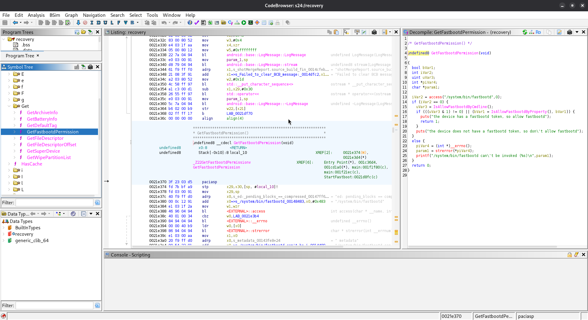
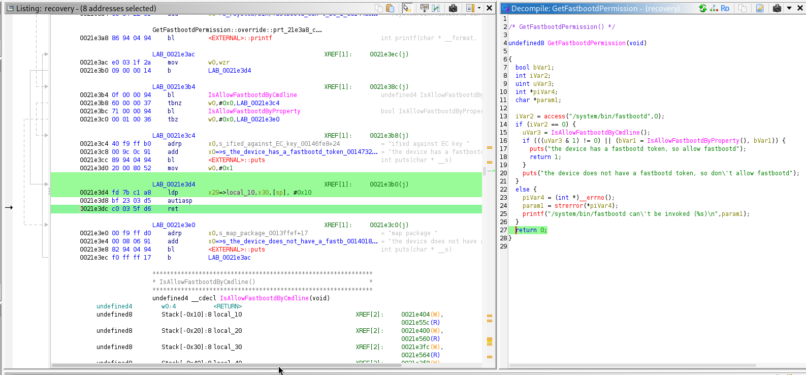
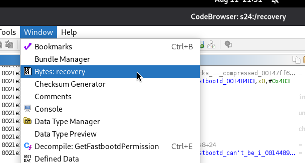
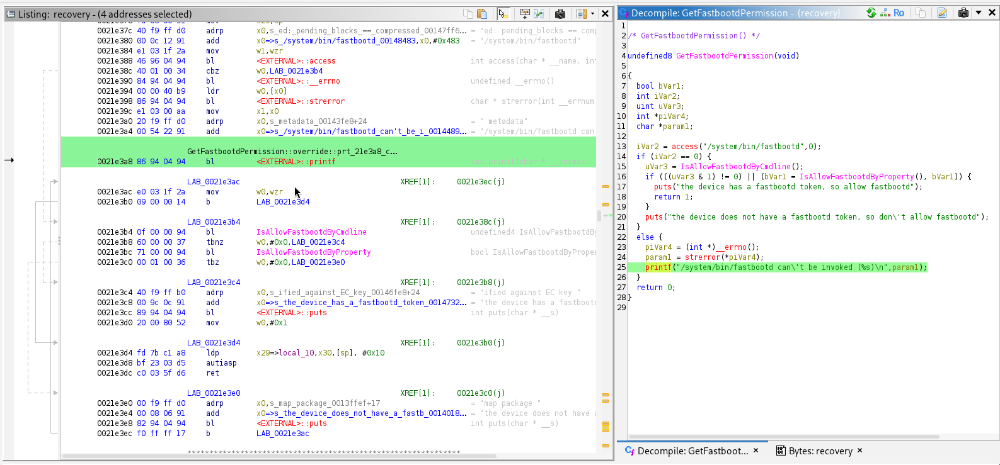
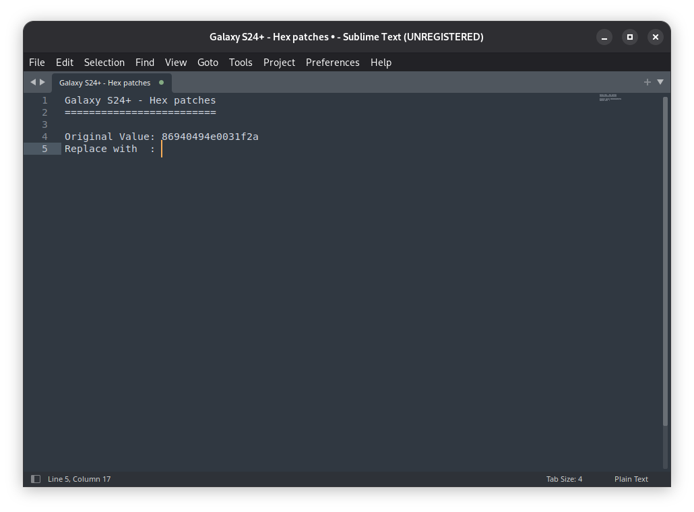
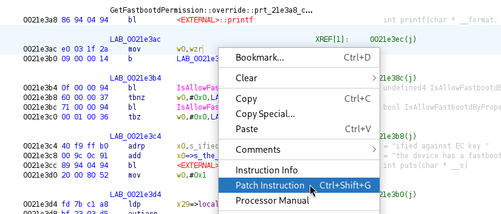
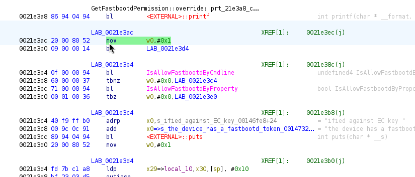
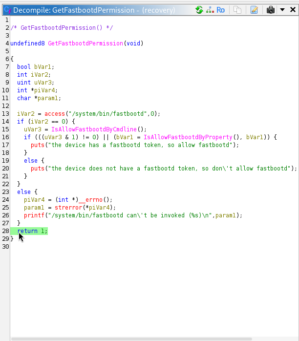
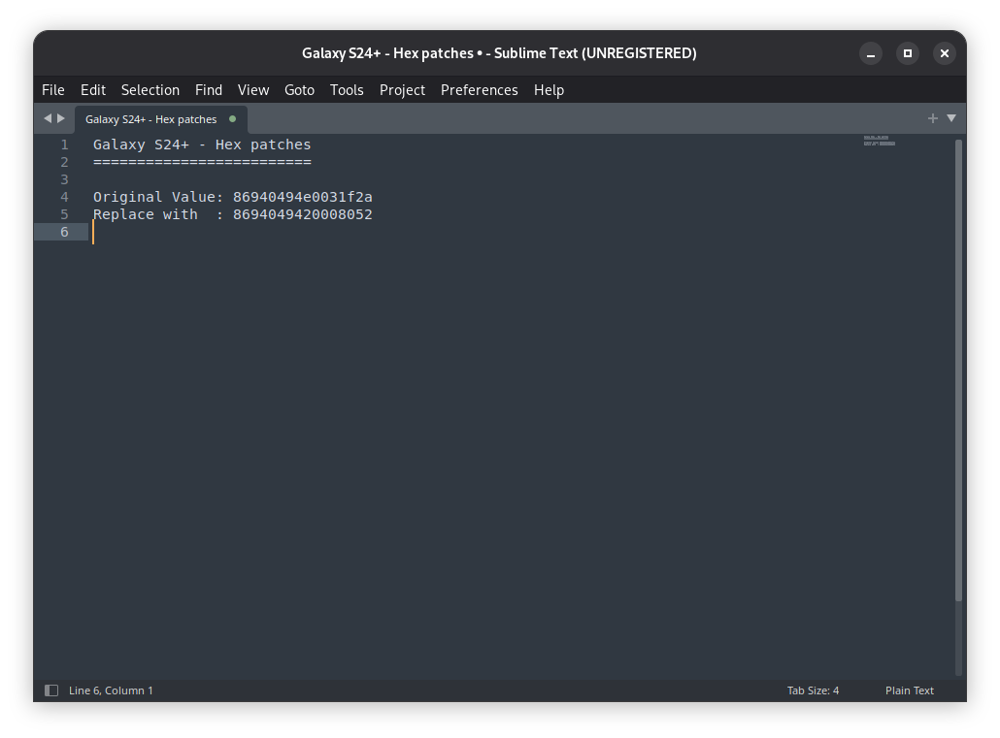

```
© 2025 @ravindu644. All rights reserved.

Unauthorized reproduction, distribution, or republication of this material, in whole or in part, is strictly prohibited without prior written permission from the author.
```

## How to Find the Correct Hex Patches if This Tool Doesn't Work for You


[](https://t.me/SamsungTweaks)

**Requirements:**  

- Knowledge of unpacking and repacking the `recovery.img` manually.  
    - Tools I suggest: [Android_boot_image_editor](https://github.com/cfig/Android_boot_image_editor), [AIK-Linux](https://github.com/SebaUbuntu/AIK-Linux-mirror)  
- A Linux PC.  
- [Ghidra](https://github.com/NationalSecurityAgency/ghidra) installed.

---

### 🟢 Method

### Step 1: Preparing

01. Unpack the `recovery.img` using your preferred tool.  
02. Go to the unpacked folder and search for a file named `recovery`.  

  
*This is the file we are looking for! (near the mouse cursor)*  

03. Copy that file to a new folder.  

---

### Step 2: Setting up a Ghidra Project

01. Go to your Ghidra folder and run it with `./ghidraRun`.  
02. Create a new project, and select that "new folder" as the project's folder.  
    - `File -> New Project`  

      
    *Creating a new project*    

03. Select your project, then go to `File -> Import File -> Select the recovery file we just extracted -> OK -> OK`.  

      

04. Now, right-click on the `recovery` file and select **Open in Default Tool**.  

      

05. Select **Yes** here:  

      

06. Click **Select All**, then press **Analyze**.  

      

07. This process will take some time to finish the analysis, so be patient!  

      

    - Click "Ok" if it gave any errors/warnings.  

---    

### Step 3: Finding what to patch !

01. Once the analysis is complete, the UI should look like this:  

      

02. On the left side of Ghidra, in the **Symbol Tree**, there’s a drop-down menu called **Functions**.  

      

03. Expand it and find the functions that start with the name **Get**.  

      

04. As you can see at the bottom of the screenshot above, there is a called:  
    - `GetFastbootdPermission`  

**Our goal is to modify these functions so they always return `true`,** which will re-enable **fastbootd** mode!  


### Step 4: Finding the Hex Byte Sequence

01. Now, let’s begin to patch the `GetFastbootdPermission` function.  
02. Left-click once on the function name to select it.  

      

03. On the right side of the UI, labeled as the `Decompile` view, you can see a `return` value that returns `0`!  

      

    - As I said earlier, our goal is to make it always return `1`, which enables the `fastbootd` mode again.  

04. Highlight the `return 0` statement in the `Decompile` view.

    - This action will highlight the corresponding assembly code in the middle section of the UI, known as the "listing view."
    - Our goal is to locate an instruction similar to `mov w0, wzr`.

05. However, in this case, we don’t see anything similar to `mov w0, wzr`!

    

    - Therefore, we need to investigate further.
    - In your case, you might easily find the `mov w0, wzr` instruction, but I’ve chosen a harder recovery that isn't easier to patch.  

06. Alternative way to find `mov w0, wzr`

    - Try highlighting the code **above** the `return 0` statement.

        

    - **In my case,** this corresponds to `printf("/system/bin/fastbootd can't be invoked (%s)\n", param1)`.

    - **This will display the corresponding instruction set** in the `Listing` view, related to the highlighted section in the `Decompile` view.

        

- **The closest `mov w0, wzr` instruction below the highlighted part should be the target instruction for the `return 0` statement.**  

    
    *See..! We successfully located it..*   

---

### Step 5: Extracting the "Original" and "Patched" Hex Byte Sequences

01. First, we need to extract the original hex byte sequence and save it in a text editor for reference.  
02. To do this, open the **"Bytes: <filename>"** window from the `Window` menu.  

      
    *Where it is located.*  

      
    *The `Bytes:` window*  

03. Go back to the `Decompile` view and **highlight the code linked to the `mov w0, wzr` instruction** (or the code located near that instruction).  

      
    *This will automatically highlight the corresponding instructions in the `Listing` view.*  

04. Place the red blinking cursor at the end of the `mov w0, wzr` instruction.  
    Press and hold the left mouse button, then drag upwards until you reach the instruction `bl <EXTERNAL>::printf`.  

      
    *Selection starts at `mov w0, wzr` and ends at `bl <EXTERNAL>::printf`.*  

    - Make sure the selected byte size is **8**. It’s okay if it’s slightly larger, but 8 bytes is common for this operation.  

05. **With that section highlighted,** open the `Bytes:` view and you’ll see the matching "Original" hex byte sequence highlighted there.  

      
    *Listing view and Bytes view.*  

      
    *Highlighted original hex byte sequence.*  

    - Right-click the highlighted bytes → **Copy Special → Byte String (No spaces)**.  
    - Paste this copied value into a text editor for safekeeping.  

      
    *Original hex byte sequence saved in a text editor.*  

06. **Now, let’s patch it to always return `1`!**  

    - In the `Listing` view, single-click at the end of the `mov w0, wzr` instruction to place the cursor there.  

      
    *The selected instruction turns a blue-grey shade.*  

    - Right-click and select **Patch Instruction**.  

      

    - Remove `wzr` and replace it with `#1`, resulting in:  
      `mov w0, #1`  
      Then press **Enter**.  

      
    *Changed from `w0, wzr` to `w0, #0x1`.*  

    - This forces the function’s return value to always be `1`.  

      
    *Now, the `GetFastbootdPermission()` function always returns `1`, regardless of any failed checks mentioned earlier.*  

07. Lastly, let’s get the "Patched" hex byte sequence:  

    - Highlight the patched section from `mov w0, #1` up to `<EXTERNAL>::printf` (bottom to top).  

      
    *Highlighted patched instructions.*  

    - In the `Bytes:` view, right-click → **Copy Special → Byte String (No spaces)**, then paste it into your text editor.  

      
    *Patched bytes in the `Bytes` view.*  

      
    *Patched hex byte sequence saved in the text editor.*  

- **Congratulations! We’ve successfully patched the function and obtained both the original and patched hex byte sequences.**  

### Step 6: Applying the Hex Patch

01. The hard part is done. All that’s left is to apply the hex patches we saved in our text editor.  

    - You can safely close Ghidra now.   

02. Download the latest Magisk APK, extract it, and copy the `libmagiskboot.so` file from the `lib/x86_64/` folder.  
    - Rename it to `magiskboot`.  
    - Give it executable permissions with:  
      `chmod +x magiskboot`  
    - Add it to your PATH.  

03. Open a terminal in the folder where the original `recovery` binary is located inside the extracted `recovery.img`.  

    - For example, in my case:  
      `/home/ravindu644/Documents/boot_editor_v15_r1/build/unzip_boot/root/system/bin`  

04. To hex patch the `recovery` file to re-enable **fastbootd** mode using `magiskboot`, use this command format:  

    ```
    magiskboot hexpatch /path/to/file <original hex> <modified hex>
    ```

    **In our case:**  

    ```
    magiskboot hexpatch recovery <From> <To>
    ```

Here’s how I patched the `recovery` binary:  


```

ravindu644@ubuntu:/path/to/extracted/recovery/ramdisk/system/bin $ magiskboot hexpatch recovery 86940494e0031f2a 8694049420008052

Patch @ 0x0010C120 [86940494e0031f2a] -> [8694049420008052]

```

**If it prompted `Patch @ ` like text,** that means our hex patching worked..!

> If it patches **more than 1 Patch**, that means, your patch is not unique. You have to either try to expand the address size (we choose to use 8).

**Now, re-pack the recovery image and see if it worked..!**

### Final Result:

  

---

> Now, you can apply your patches directly to the script via a PR, or create an issue about your patches in the proper format.
